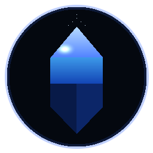
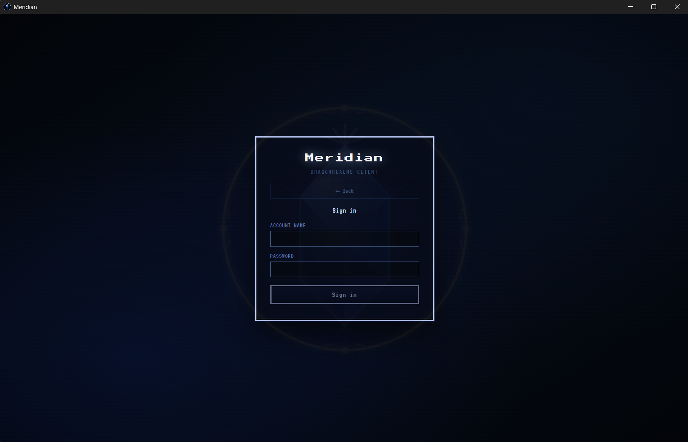
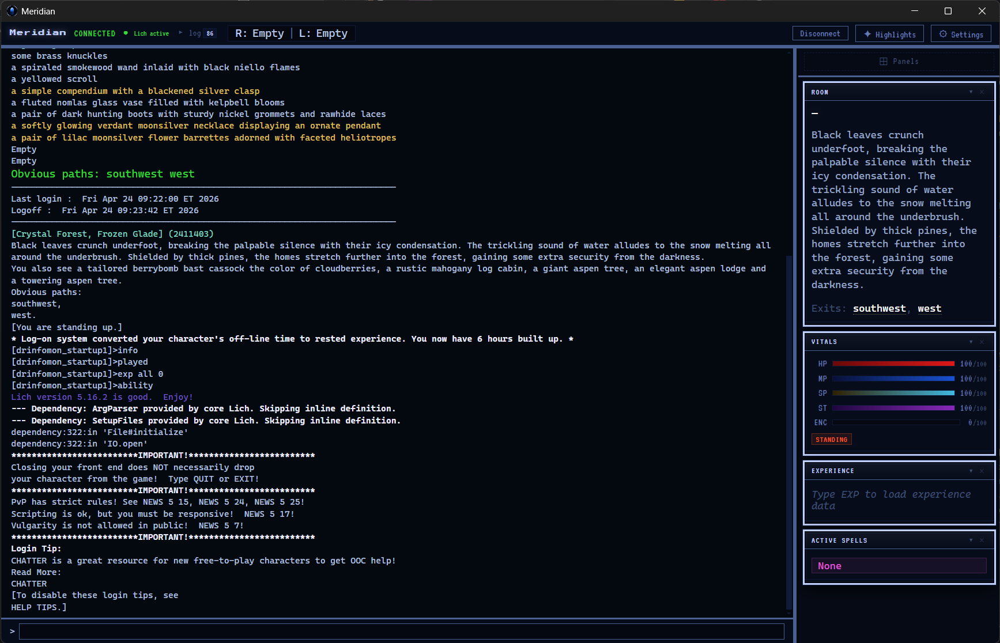

<p align="center">
  
</p>

<h1 align="center">Meridian</h1>

<p align="center">
  A modern, lightweight client for <a href="https://www.play.net/dr/">DragonRealms</a>
</p>

<p align="center">
  <a href="https://github.com/jackfperryjr/meridian/releases/latest">
    
  </a>
  
  
</p>

<br />

<p align="center">
  
</p>

---

## Features

- **Live vitals** — Health, mana, stamina, and spirit bars update in real time from the game stream
- **Smart panels** — Room info, experience tracker, active spells, combat log, conversation history, inventory, and atmosphere — all collapsible, resizable, and individually toggleable
- **Clickable exits** — Room exits are links; click to move
- **Command history** — Arrow keys recall previous commands
- **Text highlights** — Color-code any word, phrase, or regex pattern in the output
- **Multiple themes** — Choose from several dark color themes; changes apply instantly
- **Adjustable display** — Pick your font family and size
- **Lich integration** — Optionally launch [Lich5](https://lichproject.org/) scripts alongside your session
- **Auto-update** — Checks for new releases on startup and prompts to install

<p align="center">
  
</p>

---

## Download

Grab the latest installer from the [Releases page](https://github.com/jackfperryjr/meridian/releases/latest).

| Platform | File |
|----------|------|
| Windows  | `Meridian-Setup-x.x.x.exe` |
| macOS    | `Meridian-x.x.x.dmg` |
| Linux    | `Meridian-x.x.x.AppImage` |

> **Windows note:** You may see a SmartScreen prompt on first launch. Click **More info → Run anyway**. This is expected for apps without a paid code-signing certificate.

---

## Getting Started

1. Launch Meridian and sign in with your Simutronics account credentials.
2. Select your game server and character.
3. Play — panels populate automatically as game data arrives.

For a full feature walkthrough, see the **[Player Guide](GUIDE.md)**.

---

## Lich Scripting

Lich is optional — Meridian works as a standalone client without it.

1. Install Ruby and [Lich5](https://github.com/elanthia-online/lich-5) via the Ruby4Lich5 installer.
2. In Meridian's **⚙ Settings**, set the **Lich path** to your `lich.rbw` (e.g. `C:\Ruby4Lich5\Lich5\lich.rbw`).
3. Log in normally — Meridian handles authentication and launches Lich automatically.

Once connected with Lich active, `;commands` route through Lich's scripting engine.

---

## Development

### Prerequisites

- [Node.js](https://nodejs.org/) 20+
- [Git](https://git-scm.com/)

### Setup

```bash
git clone https://github.com/jackfperryjr/meridian.git
cd meridian
npm install
npm run dev
```

### Build

```bash
npm run build        # compile only
npm run package      # compile + package installer
```

Releases are built and published automatically via GitHub Actions when a new version tag is pushed.

---

## Tech Stack

| Layer | Technology |
|-------|------------|
| Shell | [Electron](https://www.electronjs.org/) 31 |
| UI | [React](https://react.dev/) 18 + [Jotai](https://jotai.org/) |
| Build | [electron-vite](https://electron-vite.org/) + [electron-builder](https://www.electron.build/) |
| Protocol | Simutronics SGE / GSIV XML |

---

<p align="center">
  Meridian is an unofficial community client &mdash; DragonRealms is a product of <a href="https://www.play.net">Simutronics Corp</a>.
</p>
